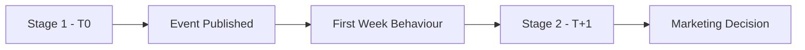
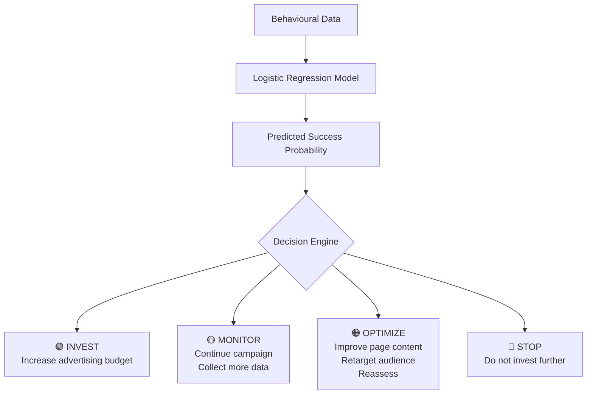

# Two-Stage Marketing Decision Support System

###  Predicting Event Success Before Publication and Optimizing Marketing Investments with Machine Learning

**Author:** Erica Corradini

---
## Project Overview
Marketing decisions evolve over time.
This repository presents a two-stage machine learning framework designed to support event planning throughout the early lifecycle of an event.
> The first model (T0) predicts event success before publication using only static event information.
> The second model (T+1 Week) updates the prediction using user engagement metrics collected during the first week after publication, enabling dynamic marketing optimization.
Together, the two models demonstrate how predictive analytics can support strategic decision-making before and after an event is launched.

## Why This Project?
Most machine learning projects stop at predicting an outcome. In practice, however, business decisions are continuous: marketing strategies evolve as new information becomes available.
This project goes beyond prediction by developing a two-stage marketing decision-support system. It combines pre-publication forecasting with post-publication behavioural analysis to help marketing teams prioritize events, optimize advertising investments and make data-driven decisions throughout the early lifecycle of an event.
> **Used Tools**
>
> Python • Pandas • NumPy • SciPy • Scikit-learn • Matplotlib • Seaborn
> ## Key Results
>| Metric | T0 | T+1 |
>|:-------|:--:|:--:|
>| **Dataset** | 826 historical events | 826 historical events |
>| **Prediction Stage** | Before publication | One week after publication |
>| **Model** | Logistic Regression | Logistic Regression |
>| **Accuracy** | **70.9%** | **84.2%** |
>| **ROC-AUC** | **0.73** | **0.92** |
>| **Success Recall** | **68%** | **82%** |
>| **Business Output** | Event Success Score | Marketing Recommendation |
>| **Decision Support** | Prioritize events before launch | INVEST · MONITOR · OPTIMIZE · STOP |
>| Stage | Objective | Accuracy | ROC-AUC |
>|-------|-----------|---------:|--------:|
>| **T0** | Predict event success before publication | **70.9%** | **0.73** |
>| **T+1** | Update predictions using behavioural data | **84.2%** | **0.92** |

## Table of Contents
1. [Business Problem](#business-problem)

2. [Dataset Overview](#dataset-overview)

3. [Data Pivacy](#data-privacy)

4. [Model Comparison](#model-comparison)

7. [Forecasting Models](#forecasting-models)

8. [Model Evaluation](#model-evaluation)

9. [Monte Carlo Simulation](#monte-carlo-simulation)

10. [Business Conclusions](#business-conclusions)

11. [Final takeaway](#final-takeaway)

## Business Problem
Launching an unsuccessful event generates unnecessary marketing costs and inefficient resource allocation.
The objective of this project is to support decision-making before publication by estimating the probability that an event will be successful, using the resulting predictions to optimize advertising budgets, prioritize marketing campaigns and improve operational planning.

## Stage 1 — Pre-Publication Prediction (T0)
Notebook:
📓 [01_Pre_Publication_Prediction.ipynb](01_Pre_Publication_Prediction.ipynb)

## Stage 2 — Post-Publication Optimization (T+1)
Notebook:
📓 [02_Post_Publication_Optimization.ipynb](02_Post_Publication_Optimization.ipynb)

## Dataset Overview
The analysis is based on **826 historical events** collected from an Italian company operating in the social events industry.
Each observation represents a single published event and includes:
- 📍 Event characteristics (city, category, date, target age group)
- 📈 Audience engagement metrics (visualizations, reading time, conversion rate)
- 🎟️ Early booking information
- ✅ Final event outcome (successful / unsuccessful)
To reflect a realistic business workflow, the project is divided into two prediction stages:

| Stage | Available Information |
|-------|------------------------|
| **T0** | Static event information available before publication |
| **T+1** | Static information + first-week behavioural metrics |

## Data Privacy 
The original business dataset has been fully anonymized. Personal information and sensitive business details have been removed or modified to preserve confidentiality while maintaining the analytical structure of the data.

## Model Comparison
The project is built around a **two-stage decision-support framework**, where each model addresses a different business question.

| Aspect | **Stage 1 (T0)** | **Stage 2 (T+1)** |
|:------|:-----------------|:------------------|
| **Prediction Timing** | Before publication | One week after publication |
| **Available Data** | Static event information | Static information + behavioural metrics |
| **Objective** | Estimate event potential | Update predictions using real user behaviour |
| **Accuracy** | **70.9%** | **84.2%** |
| **ROC-AUC** | **0.73** | **0.92** |
| **Primary Business Value** | Campaign prioritization | Marketing optimization |
| **Business Decision** | Should this event be promoted? | Should the marketing strategy change? |
| **Output** | Event Success Score | Marketing Recommendation |

### Key Insight
The T0 model provides an initial prediction before publication, supporting campaign planning and early budget allocation.
After one week, the T+1 model incorporates behavioural signals such as visitor growth, reading time, conversion rate and early bookings, substantially improving predictive performance and enabling dynamic marketing >decisions.
Rather than replacing the first model, the T+1 model **extends** it, creating a practical two-stage decision-support framework that continuously updates recommendations as new information becomes available.

## Decision Support Framework

## Business Impact

| Stage | Marketing Benefit |
|--------|-------------------|
| **Before publication** | Prioritize campaigns and allocate the initial advertising budget |
| **After one week** | Update marketing strategy using behavioural engagement signals |
| **Overall framework** | Support dynamic, data-driven marketing decision-making throughout the event lifecycle |

## Example Predictions (T0)

The T0 model estimates the probability of success **before an event is published**, using only static event information.

| City | Event Category | Day | Month | Age Group | Success Score | Priority |
|:----|:---------------|:---:|:-----:|:---------:|--------------:|:---------|
| City_1 | Category_8 | Day_5 | Month_1 | Age Group 2 | **0.326** | 🔴 LOW POTENTIAL |
| City_56 | Category_9 | Day_4 | Month_10 | Age Group 1 | **0.304** | 🔴 LOW POTENTIAL |
| City_4 | Category_1 | Day_3 | Month_5 | Age Group 2 | **0.428** | 🟡 MEDIUM POTENTIAL |
| City_60 | Category_5 | Day_5 | Month_8 | Age Group 1 | **0.498** | 🟡 MEDIUM POTENTIAL |

These examples illustrate how the T0 model assigns a **success score** and a corresponding **marketing priority** before publication. This early assessment enables marketing teams to prioritize campaigns and allocate advertising resources before behavioural data become available.

## Example Predictions (T+1)

The T+1 model updates event predictions **one week after publication** by incorporating early behavioural metrics such as bookings and conversion rates. Based on these signals, the Decision Support System generates actionable marketing recommendations.

| City | Event Category | Success Probability | Booked | Conversion | Signal | Recommendation | Marketing Action |
|:----|:---------------|--------------------:|-------:|-----------:|:------:|:--------------|:-----------------|
| City_56 | Category_8 | **97.2%** | 8 | 10.0% | 🟢 | **INVEST** | Increase advertising budget |
| City_2 | Category_9 | **0.8%** | 1 | 7.0% | 🟠 | **OPTIMIZE** | Improve campaign |
| City_8 | Category_5 | **81.0%** | 7 | 33.0% | 🟢 | **INVEST** | Increase advertising budget |
| City_31 | Category_1 | **2.6%** | 4 | 25.0% | 🟠 | **OPTIMIZE** | Improve campaign |
| City_42 | Category_7 | **4.4%** | 0 | 0.0% | 🔴 | **STOP** | Reduce advertising spend |

These examples demonstrate how the T+1 model transforms behavioural data into **actionable marketing decisions**. Instead of providing only a probability of success, the Decision Support System recommends whether to **INVEST**, **OPTIMIZE**, or **STOP** each campaign, enabling marketing teams to dynamically adjust advertising strategies as new engagement data become available.

## Key Takeaway
Rather than developing a single prediction model, this project demonstrates how machine learning can support marketing decisions throughout the lifecycle of an event.
The proposed two-stage framework combines pre-publication forecasting with post-publication optimization, illustrating how predictive analytics can evolve from a simple classification model into a practical business decision-support system.

