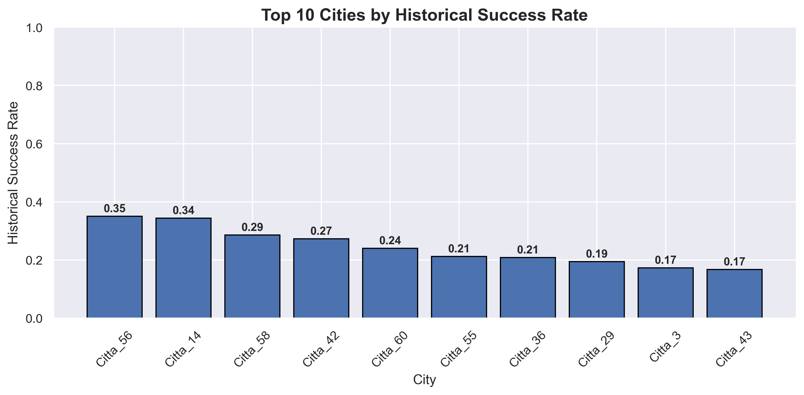

# Predicting Event Success for Data-Driven Marketing Decisions
This project analyzes historical data from an Italian company organizing social events and experiences. The goal is to predict whether an event will succeed or fail using only information available at publication time (T0).
## Project Overview
Marketing teams frequently invest advertising budgets without knowing whether an event is likely to succeed.
This project develops a machine learning model capable of predicting event success using only the information available at publication time (T0).
Rather than simply building a classifier, the project demonstrates how predictive analytics can support marketing planning, reduce investment risk and prioritize high-potential events before launch.
## Business Problem
Launching an unsuccessful event generates unnecessary marketing costs and inefficient resource allocation.
The objective of this project is to support decision-making before publication by estimating the probability that an event will be successful, using the resulting predictions to optimize advertising budgets, prioritize marketing campaigns and improve operational planning.
## Business Questions
This analysis aims to answer the following business questions:
• Which events are most likely to succeed?
• Which variables have the greatest impact on event success?
• Which cities and event categories perform best?
• Can machine learning improve marketing decisions before publication?
• How can predicted success scores support budget allocation?
• How can the model be transformed into a practical decision-support tool?
## Key Results
| KPI | Result |
|------|---------|
| Dataset | 666 historical events |
| Target | Event Success |
| Model | Logistic Regression |
| Accuracy | 76% |
| ROC-AUC | 0.70 |
| Business Goal | Marketing Budget Optimization |
| Final Output | Event Success Probability |
## Data Preparation
Only variables available before event publication (T0) were retained.
Variables describing user behaviour after publication (such as one-week visitors and reading time evolution) were removed to simulate a realistic business scenario.
This prevents data leakage and ensures that predictions can be used operationally before launching an event.

```python
# import libraries:
%matplotlib inline
import numpy as np  
import pandas as pd 
import matplotlib.pyplot as plt
import seaborn as sns
from sklearn.model_selection import train_test_split
from sklearn.preprocessing import StandardScaler
from sklearn.linear_model import LogisticRegression
from sklearn.metrics import accuracy_score, classification_report, roc_auc_score, confusion_matrix
from sklearn.metrics import roc_curve
from IPython.core.display import HTML as Center
```
```python
#Centering the plots
Center(""" <style>
.jp-RenderedImage {
    display: table-cell;
    text-align: center;
    vertical-align: middle;
}
</style> """)
```
```python
# Seaborn visualization settings:
sns.set_theme(
    style="darkgrid",      
    context="notebook",        
    palette="deep"
)
```
```python
# Load cleaned dataset
df = pd.read_excel("anonimized_data.xlsx")

# Remove variables unavailable at publication time
df_t0 = df.drop(columns=[
    "VISITATORI + 1 WEEK",
    "DELTA VISITATORI",
    "TEMPO DI LETTURA",
    "TEMPO + ONE WEEK"
])

df_t0.head()
```
| Day | Month | Visitors | City | Age Group | Current Bookings | Conversion Rate | Event Category | Region | Year | Success |
|:----|:------|---------:|:-----|:----------|-----------------:|----------------:|:---------------|:-------|-----:|--------:|
| Day_4 | Month_1 | 4  | City_1 | Age_Group_2 | 0 | 0.0000 | Category_4 | North   | 2023 | 0 |
| Day_4 | Month_1 | 4  | City_2 | Age_Group_2 | 5 | 0.0602 | Category_8 | Central | 2022 | 0 |
| Day_5 | Month_3 | 45 | City_2 | Age_Group_2 | 3 | 0.0566 | Category_4 | Central | 2022 | 0 |
| Day_5 | Month_2 | 21 | City_2 | Age_Group_2 | 2 | 0.0667 | Category_4 | Central | 2022 | 0 |
| Day_3 | Month_2 | 88 | City_2 | Age_Group_2 | 3 | 0.0337 | Category_4 | Central | 2022 | 0 |
> **Target Variable**
>
> **Success**
> - **1** → Successful event
> - **0** → Unsuccessful event
The cleaned dataset contains only information available at the time of publication (T0), ensuring that the machine learning model predicts event success without using future information and avoiding data leakage.
## Exploratory Data Analysis
### Target Distribution
```python
target_distribution = (
    df_t0["STATO"]
    .value_counts(normalize=True)
    .rename_axis("Outcome")
    .reset_index(name="Percentage")
)

display(target_distribution)
```
| Outcome | Percentage |
|:--------|-----------:|
| 🔴 Failure (0) | **86.91%** |
| 🟢 Success (1) | **13.09%** | 

> **Business Insight:** 
>Approximately 87% of historical events were unsuccessful.
>This strong imbalance reflects a realistic business scenario where successful events are relatively rare, making prediction significantly more challenging.
```python
### Top Performing Cities
```python
# Analyze historical success rate by city 
city_analysis = df_t0.groupby('CITTA')['STATO'].agg(['count', 'sum'])

city_analysis['success_rate'] = city_analysis['sum'] / city_analysis['count']

city_analysis = city_analysis.sort_values(by='success_rate', ascending=False)
city_analysis = city_analysis[city_analysis['count'] > 5]
city_analysis.head(10)
```
```python
# Top performing cities
plt.figure(figsize=(10,5))

top_cities = city_analysis.sort_values(
    by="success_rate",
    ascending=False
).head(10)

bars = plt.bar(
    top_cities.index,
    top_cities["success_rate"],
    edgecolor="black"
)

for bar in bars:
    plt.text(
        bar.get_x() + bar.get_width()/2,
        bar.get_height() + 0.015,
        f"{bar.get_height():.2f}",
        ha="center",
        fontsize=10,
        fontweight="bold"
    )

plt.title("Top 10 Cities by Historical Success Rate", fontsize=15, fontweight="bold")
plt.xlabel("City")
plt.ylabel("Historical Success Rate")
plt.ylim(0,1)
plt.xticks(rotation=45)
sns.despine()
plt.tight_layout()
plt.show()
```

>  ***Business Insight:**
>Historical performance varies considerably across cities. Some locations consistently achieve higher success rates, suggesting that geographical context plays a significant role in event performance.
### Event Categories
```python
#  Best performing events
categoria_analysis = df_t0.groupby('CATEGORIA')['STATO'].agg(['count', 'sum'])

categoria_analysis['success_rate'] = categoria_analysis['sum'] / categoria_analysis['count']
categoria_analysis = categoria_analysis[categoria_analysis['count'] >= 10]
categoria_analysis.sort_values(by='success_rate', ascending=False)
```
| Event Category | Events | Successful Events | Success Rate |
|:---------------|-------:|------------------:|-------------:|
| 🥇 Category_4 | 353 | 61 | **17.28%** |
| 🥈 Category_3 | 152 | 20 | **13.16%** |
| 🥉 Category_9 | 77 | 8 | **10.39%** |
| Category_8 | 74 | 7 | **9.46%** |
| Category_11 | 135 | 7 | **5.19%** |
| Category_1 | 10 | 0 | **0.00%** |
>  **Business Insight:**
> Event performance varies considerably across categories. **Category_4** achieved the highest historical success rate (17.28%) while also representing the largest share of events, suggesting it offers the greatest marketing potential. Conversely, **Category_1** recorded no successful events during the observed period, indicating a low-priority category for future marketing investments.
```python

```
```python

```
```python

```
```python

```
```python

```


